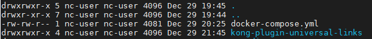
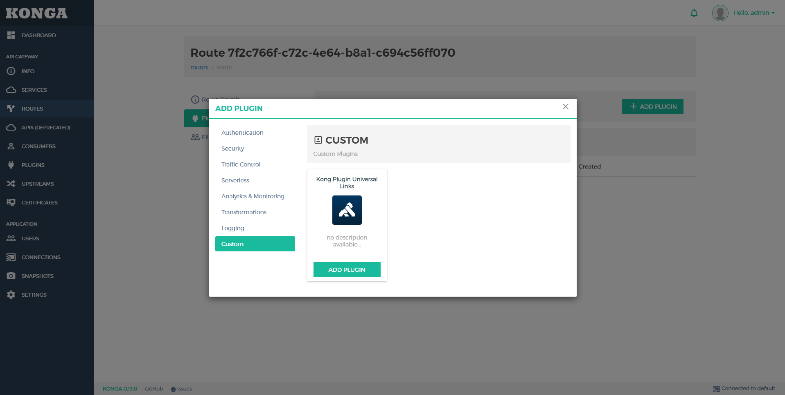
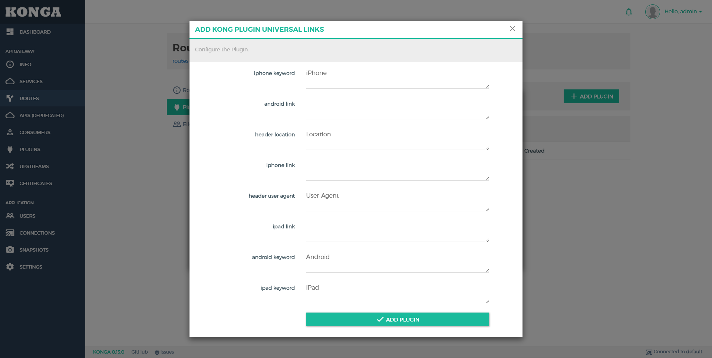

# kong-plugin-universal-links

## apply with kong (docker-compose)

### docker-compose.yml

kong version: 0.14

add environment KONG_PLUGINS: bundled,kong-plugin-universal-links

add volumes ./kong-plugin-universal-links/kong/plugins/kong-plugin-universal-links:/usr/local/share/lua/5.1/kong/plugins/kong-plugin-universal-links

    version: "3"

    networks:
     kong-net:
      driver: bridge

    services:
      ... other service ...
      #######################################
      # Kong: The API Gateway
      #######################################
      kong:
        image: kong:0.14
        restart: always
        networks:
          - kong-net
        environment:
          KONG_PG_HOST: kong-database
          KONG_PROXY_LISTEN: 0.0.0.0:8000, 0.0.0.0:8443 ssl
          KONG_ADMIN_LISTEN: 0.0.0.0:8001
          KONG_PROXY_ACCESS_LOG: /dev/stdout
          KONG_PROXY_ERROR_LOG: /dev/stdout
          KONG_PLUGINS: bundled,kong-plugin-universal-links
    custom
        depends_on:
          - kong-migration
          - kong-database
        healthcheck:
          test: ["CMD", "curl", "-f", "http://kong:8001"]
          interval: 5s
          timeout: 2s
          retries: 15
        ports:
    #      - "8001:8001"
          - "8000:8000"
          - "8443:8443"         # NOTE: custom add      
          - "80:8000"           # NOTE: custom add
          - "443:8443"          # NOTE: custom add
        volumes:                # NOTE: custom add mounted volume to kong
          - ./kong-plugin-universal-links/kong/plugins/kong-plugin-universal-links:/usr/local/share/lua/5.1/kong/plugins/kong-plugin-universal-links

### plugins

    git clone https://github.com/roticagas/kong-plugin-universal-links.git
    
### directory

### run

    docker-compose up -d

### konga

### P.S

when update plugin use reload command:

        docker exec <kong name> kong reload
        
        
